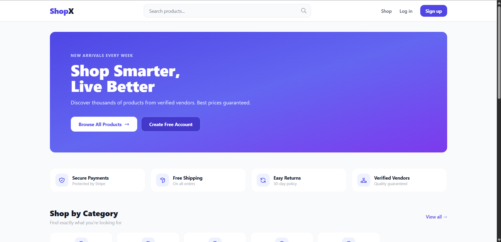
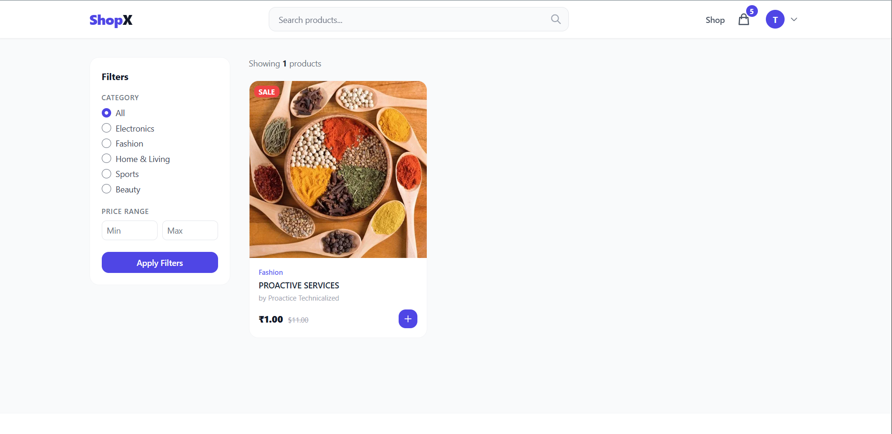
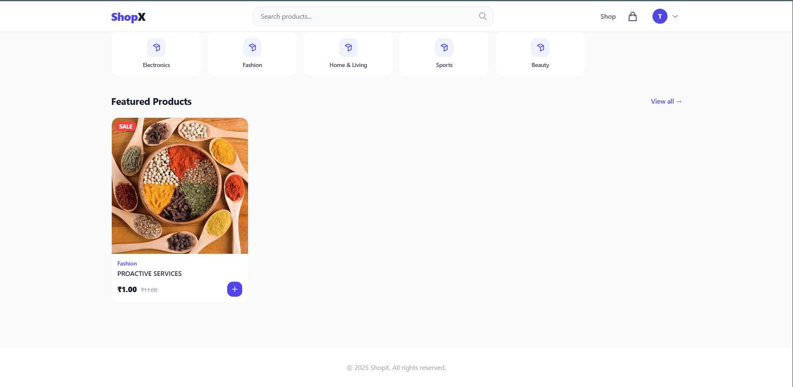
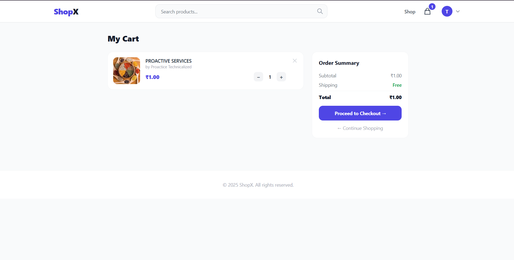
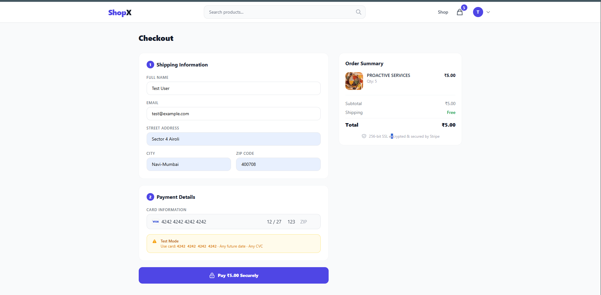
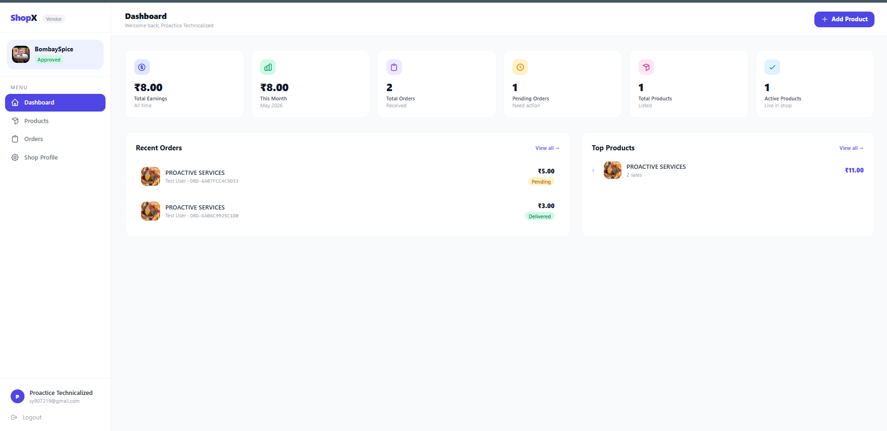
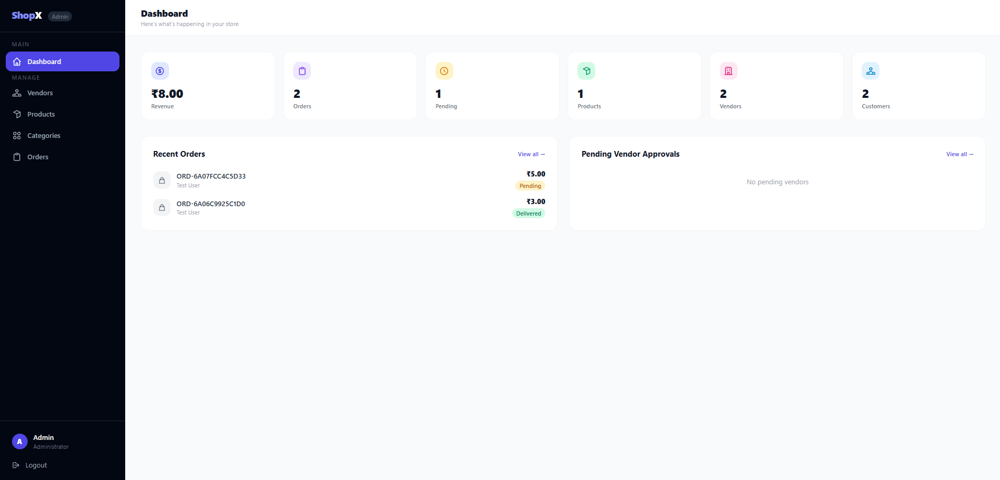

<div align="center">

# 🛒 ShopX — Multi-Vendor E-Commerce Platform


**A full-stack multi-vendor e-commerce platform built with Laravel 12, 
Tailwind CSS, Stripe payments, and REST API.**

[🌐 Live Demo](https://shopx.proactivetechnicalized.com/) · 

</div>

---

## 📸 Screenshots

### 🏠 Home Page


### 🛍️ Shop Page


### 📦 Product Page


### 🛒 Cart & Checkout



### 🏪 Vendor Dashboard


### ⚙️ Admin Panel


---

## ✨ Features

### 👥 Three Role System
- **Admin** — Full platform control
- **Vendor** — Shop management & order tracking
- **Customer** — Browse, cart & checkout

### 🏪 Vendor Features
- 5-Step KYC Onboarding (Shop → Contact → Bank → Identity → Review)
- Product management with multiple image upload
- Real-time earnings & sales dashboard
- Order status management per item
- Shop profile with logo

### 🛍️ Customer Features
- Browse products without login
- Search & filter by category, price
- Cart with quantity management
- Stripe payment integration

### ⚙️ Admin Features
- Vendor approval/rejection workflow
- Category management with subcategories
- Order management & status updates
- Product moderation (activate/deactivate)
- Revenue & stats dashboard

---

## 🛠️ Tech Stack

| Category | Technology |
|---|---|
| **Backend** | Laravel 12, PHP 8.2 |
| **Frontend** | Blade, Tailwind CSS v3, Alpine.js |
| **Database** | MySQL 8 |
| **Auth** | Laravel Breeze + Sanctum (API) |
| **Payment** | Stripe |
| **Storage** | Laravel Storage (Local/S3 ready) |
| **Deploy** | Hostinger VPS |

---

## 🗄️ Database Schema

```
users                    → Multi-role (admin/vendor/customer)
vendor_profiles          → KYC info, bank details, shop info
categories               → Parent + subcategories
products                 → Vendor products with variants
product_images           → Multiple images per product
carts                    → Customer cart items
orders                   → Order header with Stripe payment
order_items              → Per-vendor order line items

```

---

## 🚀 Local Setup

### Prerequisites
- PHP 8.2+
- Composer
- Node.js 18+
- MySQL 8+

### Installation

```bash
# Clone the repository
git clone https://github.com/shubham-yadav105/multivendor.git
cd shopx

# Install PHP dependencies
composer install

# Install Node dependencies
npm install

# Setup environment
cp .env.example .env
php artisan key:generate

# Configure your .env
# Set DB_DATABASE, DB_USERNAME, DB_PASSWORD
# Set STRIPE_KEY and STRIPE_SECRET

# Run migrations & seed
php artisan migrate --seed

# Create storage symlink
php artisan storage:link

# Build assets
npm run dev

# Start server
php artisan serve
```

Visit `http://127.0.0.1:8000`

---

## 👤 Demo Accounts

| Role | Email | Password |
|---|---|---|
| Admin | admin@shopx.com | password |
| Vendor | techzone@shopx.com | password |
| Vendor | fashion@shopx.com | password |
| Customer | alice@test.com | password |
| Customer | bob@test.com | password |

---

## 💳 Test Payment

Use Stripe test card:
```
Card Number : 4242 4242 4242 4242
Expiry      : Any future date
CVC         : Any 3 digits
```
---

## 📁 Project Structure

```
app/
├── Http/
│   ├── Controllers/
│   │   ├── Admin/          → Admin panel controllers
│   │   ├── Vendor/         → Vendor panel controllers
│   │   ├── Customer/       → Customer controllers
│   │   └── Api/            → REST API controllers
│   ├── Middleware/          → Role-based middleware
│   └── Resources/          → API resources
├── Models/                  → Eloquent models
database/
├── migrations/              → Database schema
└── seeders/                 → Test data
resources/
└── views/
    ├── layouts/             → Admin, vendor, customer, public layouts
    ├── admin/               → Admin panel views
    ├── vendor/              → Vendor panel views
    ├── customer/            → Customer panel views
    └── auth/                → Login, register pages
routes/
├── web.php                  → Web routes
└── api.php                  → API routes
```

---

## 🔐 Security Features

- ✅ Role-based middleware protection
- ✅ CSRF protection on all forms
- ✅ Input validation & sanitization
- ✅ Stripe server-side payment verification
- ✅ Vendor can only edit own products
- ✅ API token authentication via Sanctum
- ✅ SQL injection prevention via Eloquent ORM

---

## 🌐 Deployment

Deployed on **Hostinger** with:
- PHP 8.2
- MySQL 8
- SSL Certificate (HTTPS)
- Laravel production optimizations

---

## 📄 License

MIT License — feel free to use this project for learning.

---

<div align="center">

**Built with ❤️ using Laravel & Tailwind CSS**

⭐ Star this repo if you found it helpful!

</div>